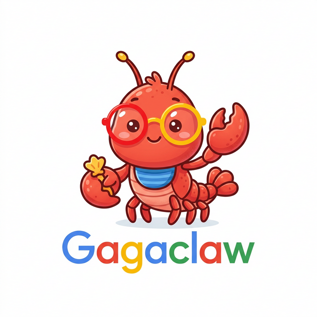

<p align="center">
  
</p>

<h1 align="center">Gagaclaw v1.1</h1>

> **The remote controller for your Antigravity.**

> Supports **Windows** and **Linux** (including Docker) with [Antigravity IDE](https://www.antigravity.so).

**Gagaclaw** is a bridge layer that connects messaging platforms (Telegram, CLI) to [Antigravity IDE](https://www.antigravity.so), turning it into a remotely controllable AI agent.

It intercepts Antigravity's internal communication via Chrome DevTools Protocol (CDP), allowing you to send prompts, receive streamed responses, approve tool permissions, and manage sessions — all from your phone or terminal.

## Features

- **Telegram Bot** — Full-featured bot with inline keyboard buttons, streaming responses, file upload/download, and command autocomplete
- **CLI Interface** — Terminal-based interactive session with colored output
- **Multi-Model Support** — Switch between Gemini, Claude, and GPT models on the fly
- **Cron Scheduler** — Schedule recurring AI tasks with customizable model/mode per job
- **MCP Server** — Includes `gagaclaw_recommend_mcp` for Groq audio transcription and Telegram file sending
- **Permission System** — Inline keyboard approval/denial for tool calls, with optional YOLO auto-approve mode
- **Workspace System** — Isolated workspaces with per-workspace personality (`soul.md`) and memory (`memory.md`)

## Requirements

- Windows 10/11 or Linux (Ubuntu 20.04+, Debian 11+, etc.)
- [Node.js](https://nodejs.org/) 18+
- [Antigravity IDE](https://www.antigravity.so)
- A Telegram bot token (from [@BotFather](https://t.me/BotFather))
- (Optional) [Groq API key](https://console.groq.com/keys) for audio transcription

## Configuration

`gagaclaw.json` fields:

| Field | Description |
|---|---|
| `telegram.token` | Bot token from [@BotFather](https://t.me/BotFather) |
| `telegram.allowedUsers` | Array of authorized Telegram user IDs (first entry is also used as admin chat for MCP/cron notifications) |
| `app.name` | IDE application name |
| `app.targetExecutables` | Process names to detect |
| `activeWorkspace` | Active workspace folder name |
| `yoloMode` | `true` = auto-approve all tool calls, `false` = ask for approval |
| `groq.apiKey` | Groq API key for audio transcription (optional) |
| `defaults.model` | Model ID (e.g. `MODEL_PLACEHOLDER_M37`). Must use full ID, not shorthand keys. See `MODELS` in core.js for available IDs. |
| `defaults.mode` | `planning` or `fast` |
| `defaults.agentic` | Enable tool usage by default |
| `defaults.cdpPorts` | Chrome DevTools Protocol ports to connect |
| `defaults.cdpHost` | CDP host address |

## Setup

Jump to the [One-Click AI Setup](#one-click-ai-setup) section at the bottom — open a fresh Antigravity workspace, paste the prompt, and the AI handles everything (clone, install, configure, MCP registration).

## Telegram Commands

| Command | Description |
|---|---|
| `/help` | Show help |
| `/new` | Start new conversation |
| `/stop` | Stop current response |
| `/list` | List conversations (with switch/delete buttons) |
| `/model` | Switch AI model (inline keyboard) |
| `/mode` | Switch mode — planning / fast |
| `/agentic` | Toggle tool usage ON/OFF |
| `/yolo` | Toggle auto-approve ON/OFF |
| `/ws` | Switch workspace |
| `/cron` | Manage scheduled tasks |
| `/restart` | Warm or cold restart |

All commands support both inline keyboard buttons (tap to select) and text arguments (e.g., `/model flash`).

## Cron Jobs

Gagaclaw can run scheduled AI tasks automatically. Copy the example and edit:

```bash
cp cronjobs.example.json cronjobs.json
```

Example job in `cronjobs.json`:

```json
{
  "jobs": [
    {
      "id": "news-hourly",
      "enabled": true,
      "cron": "0 * * * *",
      "prompt": "Find 5 trending news articles that match my interests",
      "model": "high",
      "mode": "fast",
      "agentic": true,
      "notify": { "telegram": 123456789 }
    }
  ]
}
```

| Field | Description |
|---|---|
| `id` | Unique job identifier |
| `enabled` | `true` / `false` |
| `cron` | Cron expression (`min hour day month weekday`) |
| `prompt` | The prompt to send to AI |
| `model` | `flash` / `low` / `high` / `opus` / `sonnet` / `gpt` (optional, defaults to gagaclaw.json) |
| `mode` | `planning` / `fast` (optional) |
| `agentic` | Enable tool usage (optional) |
| `notify` | `{ "telegram": true }` to send results to Telegram |
| `cascadeId` | Reuse a specific conversation; omit to create new each time |

Manage jobs in Telegram with `/cron` (shows ON/OFF toggle buttons per job).

## MCP Server

The included `gagaclaw_recommend_mcp` provides two tools:

- **`groq_transcribe`** — Transcribe audio files to text using Groq Whisper API
- **`telegram_send_file`** — Send files to Telegram admin chat (auto-converts `.md` to `.html`)

To register it in Antigravity, add the following to your MCP settings:

```json
{
  "mcpServers": {
    "gagaclaw_recommend_mcp": {
      "command": "node",
      "args": ["/absolute/path/to/gagaclaw/gagaclaw_recommend_mcp/index.js"]
    }
  }
}
```

## Project Structure

```
gagaclaw/
├── core.js                    # Core engine (CDP, auth, session, streaming)
├── telegram.js                # Telegram bot interface
├── cli.js                     # CLI interface
├── cronjob.js                 # Cron scheduler
├── cron.js                    # Cron helper
├── gagaclaw.json              # Main config (not in repo, copy from example)
├── gagaclaw.example.json      # Config template
├── cronjobs.json              # Cron job definitions
├── mcp_config.json            # MCP server paths
├── package.json               # Dependencies
├── gagaclaw_recommend_mcp/    # MCP server (groq_transcribe + telegram_send_file)
│   └── index.js
├── .agents/rules/
│   ├── rules.example.md        # AI behavior rules (template)
│   └── rules.md               # AI behavior rules (copy from example, not in repo)
└── workspace/                 # AI workspace
    ├── soul.example.md         # Workspace personality (template)
    ├── soul.md                # Workspace personality (copy from example, not in repo)
    ├── memory.example.md       # Workspace memory (template)
    └── memory.md              # Workspace memory (copy from example, not in repo)
```

## Disclaimer

This project is provided **for research and educational purposes only**.
- **No Guarantee on AI Results:** AI-generated outputs may contain errors, inaccuracies, or unexpected behavior.
- **Risk of Data Loss & System Damage:** The AI has the ability to execute commands on your machine. The author makes no warranties and assumes no responsibility for any accidental data deletion, broken environments, or system modifications caused by AI operation errors (especially when YOLO mode is enabled).
- **Security & Privacy Risks:** The AI has access to your local filesystem. It may inadvertently read or transmit sensitive information, credentials, or private data to external AI models. Do not use this tool with highly confidential data without strict oversight.
- **Third-Party Costs:** This tool utilizes external APIs (e.g., Groq, Gemini, Claude, OpenAI). Users are solely responsible for any API usage charges or associated costs incurred.
- **Account Suspension Risk:** Using automated tools or bots may violate the terms of service of certain platforms, leading to the risk of your accounts (e.g., Google, Telegram) being suspended or banned.

**Use at your own risk.**

## License

This project is licensed under the [GNU General Public License v3.0 (GPL-3.0)](https://www.gnu.org/licenses/gpl-3.0.html).

- You are free to use, modify, and distribute this software
- Any derivative work must also be open-sourced under the same license
- You must retain the original copyright notice and license
- This software comes with absolutely no warranty

---

## One-Click AI Setup (with Linux/Docker support)

> **Just open a fresh Antigravity workspace, paste the prompt below, and the AI will handle everything — clone, install, configure, all interactive.**

### How to use:
1. Open Antigravity IDE
2. Close all other workspace tabs
3. Create or open an **empty folder** as workspace
4. Paste the entire prompt below into the chat
5. Answer the AI's questions — done!

---

```
I need you to install and configure Gagaclaw. Go through each step IN ORDER. Ask me questions when needed and WAIT for my answer before proceeding to the next step.

Step 1 — Clone & Install:
Run these commands in the current workspace directory:
  git clone https://github.com/joeIvan2/gagaclaw.git .
  npm install
  cd gagaclaw_recommend_mcp && npm install && cd ..
If git is not installed, tell me to install it from https://git-scm.com and stop.
If node/npm is not installed, tell me to install it from https://nodejs.org and stop.
Confirm when done.

Step 2 — Initialize Config Files:
  cp gagaclaw.example.json gagaclaw.json
  cp cronjobs.example.json cronjobs.json
  cp workspace/soul.example.md workspace/soul.md
  cp workspace/memory.example.md workspace/memory.md
  cp .agents/rules/rules.example.md .agents/rules/rules.md
Confirm when done.

Step 3 — Set Default Model:
Read core.js and find the MODELS object (near line 25). It lists all available models with their IDs.
Ask me which model I want as default, showing the available options:
  - MODEL_PLACEHOLDER_M18 — Gemini 3 Flash
  - MODEL_PLACEHOLDER_M36 — Gemini 3.1 Low
  - MODEL_PLACEHOLDER_M37 — Gemini 3.1 High (recommended)
  - MODEL_PLACEHOLDER_M26 — Claude 4.6 Opus
  - MODEL_PLACEHOLDER_M35 — Claude 4.6 Sonnet
  - MODEL_OPENAI_GPT_OSS_120B_MEDIUM — GPT OSS 120B
Update gagaclaw.json: set "defaults.model" to the chosen model ID string.
Do NOT use shorthand keys like "high" or "flash" — use the full MODEL_... ID.
Confirm when done.

Step 4 — Language Preference:
Ask me: "What language should I use? (e.g., English, 繁體中文, 日本語)"
After I answer, update these files to my chosen language:
- .agents/rules/rules.md — add "Preferred language: <language>" and translate content
- workspace/soul.md — translate all content, keep structure
- workspace/memory.md — set header in chosen language

Step 5 — Configure gagaclaw.json:
Read gagaclaw.json and interactively fill in each placeholder field. Ask ONE question at a time, wait for my answer, then update the file before asking the next.

5a. telegram.token
    - Placeholder: "PASTE_YOUR_BOT_TOKEN_HERE"
    - Ask me: "Please paste your Telegram bot token. (Create a bot at @BotFather on Telegram if you don't have one)"
    - Token format example: 123456789:ABCdefGHIjklMNOpqrsTUVwxyz
    - Write as a JSON string (with quotes)

5b. telegram.allowedUsers
    - Placeholder: [0]
    - Ask me: "Please enter your Telegram user ID number. (Send /start to @userinfobot on Telegram to find it)"
    - Write as a number WITHOUT quotes inside the array, e.g. [919730886]

5c. groq.apiKey
    - Placeholder: "PASTE_YOUR_GROQ_API_KEY_HERE"
    - Ask me: "Please paste your Groq API key (get one free at https://console.groq.com/keys), or type 'skip' to skip."
    - If skipped, set to empty string "" (voice transcription won't work, everything else is fine)
    - Write as a JSON string (with quotes)

5d. [🐧 LINUX] Ask me: "Are you running on Linux? (yes/no)"
    If YES, apply this change to gagaclaw.json:
    - Set "app.targetExecutables" to ["antigravity"] (lowercase, no .exe)

    Then ask: "How is Antigravity deployed? (A) Natively on host  (B) Inside a Docker container"
    Remember the answer for Step 7.

After ALL fields are updated, read gagaclaw.json back and show me the result with sensitive values masked (e.g. token: "862***lqs") so I can confirm.

Step 6 — Install MCP Server:
Register the gagaclaw_recommend_mcp MCP server in Antigravity's MCP settings.
The config should be:
  {
    "mcpServers": {
      "gagaclaw_recommend_mcp": {
        "command": "node",
        "args": ["<ABSOLUTE_PATH>/gagaclaw_recommend_mcp/index.js"]
      }
    }
  }
Replace <ABSOLUTE_PATH> with the actual absolute path to the current directory.
Confirm when registered.

Step 7 — [🐧 LINUX] Create Launch Scripts:

There are TWO deployment scenarios. Use the one matching the answer from Step 5d:

━━━━━━━━━━━━━━━━━━━━━━━━━━━━━━━━━━━━━━━━━━━━━━
[A] HOST MODE — Antigravity runs natively on the Linux host
━━━━━━━━━━━━━━━━━━━━━━━━━━━━━━━━━━━━━━━━━━━━━━

Gagaclaw and Antigravity both run directly on the host.
Launch Antigravity with:
  antigravity --no-sandbox --remote-debugging-port=9229 &

Create these scripts:

start.sh:
  #!/bin/bash
  cd "$(dirname "$0")"
  if ! curl -s http://127.0.0.1:9229/json/version > /dev/null 2>&1; then
      echo "🚀 Starting Antigravity..."
      antigravity --no-sandbox --remote-debugging-port=9229 &
      sleep 5
  fi
  node cli.js

start-telegram.sh:
  #!/bin/bash
  cd "$(dirname "$0")"
  if ! curl -s http://127.0.0.1:9229/json/version > /dev/null 2>&1; then
      echo "🚀 Starting Antigravity..."
      antigravity --no-sandbox --remote-debugging-port=9229 &
      sleep 5
  fi
  echo "📱 Starting Telegram Bot... (Press Ctrl+C to stop)"
  node telegram.js
  read -p "Press Enter to close..."

start-cron.sh:
  #!/bin/bash
  cd "$(dirname "$0")"
  if ! curl -s http://127.0.0.1:9229/json/version > /dev/null 2>&1; then
      echo "🚀 Starting Antigravity..."
      antigravity --no-sandbox --remote-debugging-port=9229 &
      sleep 5
  fi
  echo "⏰ Starting Cron Scheduler... (Press Ctrl+C to stop)"
  node cronjob.js
  read -p "Press Enter to close..."

━━━━━━━━━━━━━━━━━━━━━━━━━━━━━━━━━━━━━━━━━━━━━━
[B] DOCKER MODE — Antigravity runs inside a Docker container
━━━━━━━━━━━━━━━━━━━━━━━━━━━━━━━━━━━━━━━━━━━━━━

Ask me these Docker-specific questions (one at a time, wait for answers):
  1. "What is the Docker container name? (e.g., desktop-gui-1)"
  2. "What is the desktop user inside the container? (e.g., abc)"

Important: There are TWO sub-options for Docker:

  [B1] Gagaclaw runs INSIDE the container (e.g., double-click from container desktop)
       - Scripts must NOT use "docker exec" — Antigravity and node are available directly
       - This is the recommended approach if you access via VNC/remote desktop

  [B2] Gagaclaw runs on the HOST, connecting to Antigravity in the container via CDP
       - The container must use --network=host OR expose port 9229
       - Scripts use "docker exec" to launch Antigravity, but run "node" locally on host

Ask me: "Where will Gagaclaw run? (B1) Inside the container  (B2) On the host"

── [B1] In-Container scripts (NO docker commands): ──

start.sh:
  #!/bin/bash
  cd "$(dirname "$0")"
  if ! curl -s http://127.0.0.1:9229/json/version > /dev/null 2>&1; then
      echo "🚀 Starting Antigravity..."
      antigravity --no-sandbox --remote-debugging-port=9229 &
      sleep 5
  fi
  node cli.js

start-telegram.sh:
  #!/bin/bash
  cd "$(dirname "$0")"
  if ! curl -s http://127.0.0.1:9229/json/version > /dev/null 2>&1; then
      echo "🚀 Starting Antigravity..."
      antigravity --no-sandbox --remote-debugging-port=9229 &
      sleep 5
  fi
  echo "📱 Starting Telegram Bot... (Press Ctrl+C to stop)"
  node telegram.js
  read -p "Press Enter to close..."

start-cron.sh:
  #!/bin/bash
  cd "$(dirname "$0")"
  if ! curl -s http://127.0.0.1:9229/json/version > /dev/null 2>&1; then
      echo "🚀 Starting Antigravity..."
      antigravity --no-sandbox --remote-debugging-port=9229 &
      sleep 5
  fi
  echo "⏰ Starting Cron Scheduler... (Press Ctrl+C to stop)"
  node cronjob.js
  read -p "Press Enter to close..."

── [B2] Host-to-Container scripts (uses docker exec): ──

Replace <CONTAINER> and <USER> with the answers from above.

start.sh:
  #!/bin/bash
  cd "$(dirname "$0")"
  if ! curl -s http://127.0.0.1:9229/json/version > /dev/null 2>&1; then
      echo "🚀 Starting Antigravity in container..."
      docker exec -d -u <USER> -e DISPLAY=:1 <CONTAINER> antigravity --no-sandbox --remote-debugging-port=9229
      sleep 5
  fi
  node cli.js

start-telegram.sh:
  #!/bin/bash
  cd "$(dirname "$0")"
  if ! curl -s http://127.0.0.1:9229/json/version > /dev/null 2>&1; then
      echo "🚀 Starting Antigravity in container..."
      docker exec -d -u <USER> -e DISPLAY=:1 <CONTAINER> antigravity --no-sandbox --remote-debugging-port=9229
      sleep 5
  fi
  echo "📱 Starting Telegram Bot... (Press Ctrl+C to stop)"
  node telegram.js
  read -p "Press Enter to close..."

start-cron.sh:
  #!/bin/bash
  cd "$(dirname "$0")"
  if ! curl -s http://127.0.0.1:9229/json/version > /dev/null 2>&1; then
      echo "🚀 Starting Antigravity in container..."
      docker exec -d -u <USER> -e DISPLAY=:1 <CONTAINER> antigravity --no-sandbox --remote-debugging-port=9229
      sleep 5
  fi
  echo "⏰ Starting Cron Scheduler... (Press Ctrl+C to stop)"
  node cronjob.js
  read -p "Press Enter to close..."

Note for [B2]: The container must use --network=host so CDP port 9229 is accessible
from the host at 127.0.0.1:9229. If using bridge networking, replace 127.0.0.1 in
gagaclaw.json "defaults.cdpHost" with the container's IP address.

━━━━━━━━━━━━━━━━━━━━━━━━━━━━━━━━━━━━━━━━━━━━━━

For ALL scenarios above:
- Make scripts executable: chmod +x start.sh start-telegram.sh start-cron.sh
- Ensure /dev/shm is at least 2GB: mount -o remount,size=2G /dev/shm
- The --no-sandbox flag is required when running as non-root or in Docker
- Telegram and Cron scripts include "read" at the end so the terminal window stays open

Step 8 — Verify:
Do a final check:
- All required files exist (core.js, telegram.js, cli.js, cronjob.js, cron.js, gagaclaw.json, package.json, gagaclaw_recommend_mcp/index.js, workspace/soul.md, workspace/memory.md)
- gagaclaw.json has non-placeholder values for telegram.token and telegram.allowedUsers
- gagaclaw.json has a valid MODEL_... ID in defaults.model (not "high" or "flash")
- MCP server is registered
- node_modules exists in both root and gagaclaw_recommend_mcp/
- [🐧 LINUX] If Linux: verify targetExecutables is ["antigravity"] (not ["Antigravity.exe"])
- [🐧 LINUX] Verify CDP is accessible: curl -s http://127.0.0.1:9229/json/version
- [🐧 LINUX] Verify start.sh, start-telegram.sh, start-cron.sh exist and are executable
Report any issues found, or confirm everything is ready.

Step 9 — Done:

[🪟 WINDOWS] Tell me:
  "Setup complete! Close Antigravity IDE, then use these batch files to launch:
   - start-telegram.bat → Telegram bot
   - start.bat → CLI mode
   - start-cron.bat → Cron scheduler (run in separate terminal)
   Important: Always use the .bat files to launch — they enable the debug port and restart support."

[🐧 LINUX] Tell me:
  "Setup complete! Use these shell scripts to launch (double-click or run from terminal):
   - start.sh → CLI mode
   - start-telegram.sh → Telegram bot
   - start-cron.sh → Cron scheduler

   Each script will automatically start Antigravity with CDP if it's not already running.
   To verify CDP manually: curl -s http://127.0.0.1:9229/json/version"
```

---

<a name="繁體中文"></a>

# 🇹🇼 繁體中文版

<p align="center">
  
</p>

<h1 align="center">Gagaclaw v1.1</h1>

> **The remote controller for your Antigravity.**
> （你的專屬 Antigravity 遠端遙控器）

> 支援 **Windows** 和 **Linux**（含 Docker），搭配 [Antigravity IDE](https://www.antigravity.so) 使用。

**Gagaclaw** 是一個橋接層，將通訊平台（Telegram、CLI）連接到 [Antigravity IDE](https://www.antigravity.so)，讓它變成一個可遠端控制的 AI 代理人。

透過 Chrome DevTools Protocol（CDP）攔截 Antigravity 的內部通訊，讓你可以從手機或終端機發送提示詞、接收串流回應、核准工具權限、管理對話 — 一切盡在掌控。

## 功能特色

- **Telegram Bot** — 完整功能的機器人，支援行內鍵盤按鈕、串流回應、檔案上傳/下載、指令自動完成
- **CLI 介面** — 終端機互動式對話，支援彩色輸出
- **多模型支援** — 隨時切換 Gemini、Claude、GPT 模型
- **排程任務** — 透過 Cron 排程自動執行 AI 任務，每個任務可自訂模型/模式
- **MCP 伺服器** — 內建 `gagaclaw_recommend_mcp`，提供 Groq 語音轉文字與 Telegram 檔案傳送
- **權限系統** — 工具呼叫的行內鍵盤核准/拒絕，可選 YOLO 自動核准模式
- **工作區系統** — 獨立的工作區，每個工作區有專屬個性設定（`soul.md`）與記憶（`memory.md`）

## 系統需求

- Windows 10/11 或 Linux（Ubuntu 20.04+、Debian 11+ 等）
- [Node.js](https://nodejs.org/) 18+
- [Antigravity IDE](https://www.antigravity.so)
- Telegram 機器人 Token（從 [@BotFather](https://t.me/BotFather) 取得）
- （選用）[Groq API Key](https://console.groq.com/keys) 用於語音轉文字

## 設定說明

`gagaclaw.json` 欄位說明：

| 欄位 | 說明 |
|---|---|
| `telegram.token` | 從 [@BotFather](https://t.me/BotFather) 取得的 Bot Token |
| `telegram.allowedUsers` | 授權的 Telegram 使用者 ID 陣列（第一個也作為 MCP/排程通知的管理員聊天室） |
| `app.name` | IDE 應用程式名稱 |
| `app.targetExecutables` | 要偵測的程序名稱 |
| `activeWorkspace` | 啟用的工作區資料夾名稱 |
| `yoloMode` | `true` = 自動核准所有工具呼叫，`false` = 詢問後核准 |
| `groq.apiKey` | Groq API Key，用於語音轉文字（選用） |
| `defaults.model` | 模型 ID（例如 `MODEL_PLACEHOLDER_M37`）。必須使用完整 ID，不可使用簡寫 key。可用模型請參考 core.js 中的 `MODELS`。 |
| `defaults.mode` | `planning` 或 `fast` |
| `defaults.agentic` | 預設是否啟用工具使用 |
| `defaults.cdpPorts` | Chrome DevTools Protocol 連接埠 |
| `defaults.cdpHost` | CDP 主機位址 |

## 安裝方式

前往下方 [一鍵 AI 安裝](#一鍵-ai-安裝) 章節 — 開啟一個新的 Antigravity 工作區，貼上提示詞，AI 會自動完成所有事項（複製、安裝、設定、MCP 註冊）。

## Telegram 指令

| 指令 | 說明 |
|---|---|
| `/help` | 顯示說明 |
| `/new` | 開始新對話 |
| `/stop` | 停止目前回應 |
| `/list` | 列出對話（含切換/刪除按鈕） |
| `/model` | 切換 AI 模型（行內鍵盤） |
| `/mode` | 切換模式 — planning / fast |
| `/agentic` | 開關工具使用 |
| `/yolo` | 開關自動核准 |
| `/ws` | 切換工作區 |
| `/cron` | 管理排程任務 |
| `/restart` | 熱重啟或冷重啟 |

所有指令皆支援行內鍵盤按鈕（點選選擇）與文字參數（例如 `/model flash`）。

## 排程任務

Gagaclaw 可以自動執行排程 AI 任務。複製範本並編輯：

```bash
cp cronjobs.example.json cronjobs.json
```

`cronjobs.json` 範例：

```json
{
  "jobs": [
    {
      "id": "news-hourly",
      "enabled": true,
      "cron": "0 * * * *",
      "prompt": "找 5 篇符合我興趣的熱門新聞",
      "model": "high",
      "mode": "fast",
      "agentic": true,
      "notify": { "telegram": 123456789 }
    }
  ]
}
```

| 欄位 | 說明 |
|---|---|
| `id` | 唯一任務識別碼 |
| `enabled` | `true` / `false` |
| `cron` | Cron 表達式（`分 時 日 月 星期幾`） |
| `prompt` | 要傳送給 AI 的提示詞 |
| `model` | `flash` / `low` / `high` / `opus` / `sonnet` / `gpt`（選用，預設使用 gagaclaw.json） |
| `mode` | `planning` / `fast`（選用） |
| `agentic` | 啟用工具使用（選用） |
| `notify` | `{ "telegram": true }` 將結果傳送到 Telegram |
| `cascadeId` | 重複使用特定對話；省略則每次建立新對話 |

在 Telegram 中使用 `/cron` 管理任務（顯示每個任務的 ON/OFF 按鈕）。

## MCP 伺服器

內建的 `gagaclaw_recommend_mcp` 提供兩個工具：

- **`groq_transcribe`** — 使用 Groq Whisper API 將音訊檔轉為文字
- **`telegram_send_file`** — 傳送檔案到 Telegram 管理員聊天室（自動將 `.md` 轉換為 `.html`）

在 Antigravity 中註冊，將以下內容加入 MCP 設定：

```json
{
  "mcpServers": {
    "gagaclaw_recommend_mcp": {
      "command": "node",
      "args": ["/你的絕對路徑/gagaclaw/gagaclaw_recommend_mcp/index.js"]
    }
  }
}
```

## 專案結構

```
gagaclaw/
├── core.js                    # 核心引擎（CDP、認證、會話、串流）
├── telegram.js                # Telegram 機器人介面
├── cli.js                     # CLI 介面
├── cronjob.js                 # 排程執行器
├── cron.js                    # 排程輔助工具
├── gagaclaw.json              # 主設定檔（不在 repo 中，從範本複製）
├── gagaclaw.example.json      # 設定範本
├── cronjobs.json              # 排程任務定義
├── mcp_config.json            # MCP 伺服器路徑
├── package.json               # 相依套件
├── gagaclaw_recommend_mcp/    # MCP 伺服器（groq_transcribe + telegram_send_file）
│   └── index.js
├── .agents/rules/
│   ├── rules.example.md        # AI 行為規則（範本）
│   └── rules.md               # AI 行為規則（從範本複製，不在 repo 中）
└── workspace/                 # AI 工作區
    ├── soul.example.md         # 工作區個性（範本）
    ├── soul.md                # 工作區個性（從範本複製，不在 repo 中）
    ├── memory.example.md       # 工作區記憶（範本）
    └── memory.md              # 工作區記憶（從範本複製，不在 repo 中）
```

## 免責聲明

本專案**僅供研究與教育用途**。
- **不保證 AI 結果：** AI 產生的輸出可能包含錯誤、不準確或非預期的行為。
- **資料遺失與系統損壞風險：** AI 具有在您機器上執行指令的能力。對於 AI 操作錯誤（特別是在啟用 YOLO 自動核准模式下）所導致的任何誤刪資料、環境破壞或系統變更，作者不提供任何形式的保證，亦不承擔任何連帶責任。
- **資安與隱私風險：** AI 可存取您的本機檔案系統，可能會不慎讀取或將敏感資訊、帳號密碼或私人數據傳輸給外部 AI 模型。在沒有嚴格監控的情況下，請勿將本工具用於處理高機密資料。
- **第三方 API 費用：** 本工具會呼叫外部 API（如 Groq、Gemini、Claude、OpenAI）。使用者須自行承擔因 AI 呼叫所產生的任何 API 費用或相關成本。
- **帳號停權風險：** 使用自動化工具或機器人可能違反部分平台的服務條款，存在導致您的帳號（例如 Google、Telegram）被鎖定或封禁的風險。

**使用風險自負。**

## 授權條款

本專案採用 [GNU 通用公共授權條款 v3.0（GPL-3.0）](https://www.gnu.org/licenses/gpl-3.0.html)。

- 您可以自由使用、修改及散佈本軟體
- 任何衍生作品必須以相同授權條款開源
- 您必須保留原始版權聲明與授權條款
- 本軟體完全不提供任何保證

---

<a name="一鍵-ai-安裝"></a>

## 一鍵 AI 安裝（支援 Linux/Docker）

> **只要開啟一個新的 Antigravity 工作區，貼上下方提示詞，AI 就會自動完成一切 — 複製、安裝、設定，全程互動式引導。**

### 使用方法：
1. 開啟 Antigravity IDE
2. 關閉所有其他工作區分頁
3. 建立或開啟一個**空資料夾**作為工作區
4. 將下方整段提示詞貼入聊天
5. 回答 AI 的問題 — 完成！

---

```
請幫我安裝並設定 Gagaclaw。請按順序逐步執行，需要問我問題時請先等我回答，再進行下一步。

步驟 1 — 複製並安裝：
在目前的工作區目錄執行以下指令：
  git clone https://github.com/joeIvan2/gagaclaw.git .
  npm install
  cd gagaclaw_recommend_mcp && npm install && cd ..
如果沒有安裝 git，請告訴我從 https://git-scm.com 下載安裝，然後停止。
如果沒有安裝 node/npm，請告訴我從 https://nodejs.org 下載安裝，然後停止。
完成後請確認。

步驟 2 — 初始化設定檔：
  cp gagaclaw.example.json gagaclaw.json
  cp cronjobs.example.json cronjobs.json
  cp workspace/soul.example.md workspace/soul.md
  cp workspace/memory.example.md workspace/memory.md
  cp .agents/rules/rules.example.md .agents/rules/rules.md
完成後請確認。

步驟 3 — 設定預設模型：
讀取 core.js，找到 MODELS 物件（約第 25 行），列出所有可用模型及其 ID。
問我要使用哪個模型作為預設值，顯示以下選項：
  - MODEL_PLACEHOLDER_M18 — Gemini 3 Flash
  - MODEL_PLACEHOLDER_M36 — Gemini 3.1 Low
  - MODEL_PLACEHOLDER_M37 — Gemini 3.1 High（推薦）
  - MODEL_PLACEHOLDER_M26 — Claude 4.6 Opus
  - MODEL_PLACEHOLDER_M35 — Claude 4.6 Sonnet
  - MODEL_OPENAI_GPT_OSS_120B_MEDIUM — GPT OSS 120B
更新 gagaclaw.json：將 "defaults.model" 設為選定的模型 ID 字串。
不可使用簡寫 key（如 "high" 或 "flash"）— 必須用完整的 MODEL_... ID。
完成後請確認。

步驟 4 — 語言偏好：
問我：「您希望使用什麼語言？（例如：English、繁體中文、日本語）」
我回答後，將以下檔案更新為我選擇的語言：
- .agents/rules/rules.md — 加入「Preferred language: <語言>」並翻譯內容
- workspace/soul.md — 翻譯所有內容，保留結構
- workspace/memory.md — 以選定語言設定標題

步驟 5 — 設定 gagaclaw.json：
讀取 gagaclaw.json，互動式填入每個 placeholder 欄位。一次只問一個問題，等我回答後再更新檔案，然後才問下一個。

5a. telegram.token
    - Placeholder: "PASTE_YOUR_BOT_TOKEN_HERE"
    - 問我：「請貼上你的 Telegram Bot Token。（如果沒有，請在 Telegram 找 @BotFather 建立一個）」
    - Token 格式範例：123456789:ABCdefGHIjklMNOpqrsTUVwxyz
    - 寫入為 JSON 字串（含引號）

5b. telegram.allowedUsers
    - Placeholder: [0]
    - 問我：「請輸入你的 Telegram 使用者 ID 數字。（在 Telegram 傳送 /start 給 @userinfobot 即可取得）」
    - 寫入為不含引號的數字放在陣列中，例如 [919730886]

5c. groq.apiKey
    - Placeholder: "PASTE_YOUR_GROQ_API_KEY_HERE"
    - 問我：「請貼上你的 Groq API Key（可在 https://console.groq.com/keys 免費取得），或輸入 'skip' 跳過。」
    - 如果跳過，設為空字串 ""（語音轉文字功能將無法使用，其他功能不受影響）
    - 寫入為 JSON 字串（含引號）

5d. [🐧 LINUX] 問我：「你是在 Linux 上執行嗎？（是/否）」
    如果是，對 gagaclaw.json 做以下修改：
    - 將 "app.targetExecutables" 設為 ["antigravity"]（小寫，不加 .exe）

    然後問：「Antigravity 的部署方式是？(A) 直接安裝在主機上  (B) 在 Docker 容器內」
    記住答案，步驟 7 會用到。

所有欄位更新完成後，重新讀取 gagaclaw.json 並顯示結果，敏感資訊請遮罩顯示（例如 token: "862***lqs"），讓我確認。

步驟 6 — 安裝 MCP 伺服器：
在 Antigravity 的 MCP 設定中註冊 gagaclaw_recommend_mcp MCP 伺服器。
設定內容如下：
  {
    "mcpServers": {
      "gagaclaw_recommend_mcp": {
        "command": "node",
        "args": ["<絕對路徑>/gagaclaw_recommend_mcp/index.js"]
      }
    }
  }
將 <絕對路徑> 替換為目前目錄的實際絕對路徑。
完成後請確認。

步驟 7 — [🐧 LINUX] 建立啟動腳本：

有兩種部署情境，依據步驟 5d 的回答選擇對應的方案：

━━━━━━━━━━━━━━━━━━━━━━━━━━━━━━━━━━━━━━━━━━━━━━
[A] 主機模式 — Antigravity 直接安裝在 Linux 主機上
━━━━━━━━━━━━━━━━━━━━━━━━━━━━━━━━━━━━━━━━━━━━━━

Gagaclaw 和 Antigravity 都直接在主機上執行。
啟動 Antigravity 的指令：
  antigravity --no-sandbox --remote-debugging-port=9229 &

建立以下腳本：

start.sh:
  #!/bin/bash
  cd "$(dirname "$0")"
  if ! curl -s http://127.0.0.1:9229/json/version > /dev/null 2>&1; then
      echo "🚀 正在啟動 Antigravity..."
      antigravity --no-sandbox --remote-debugging-port=9229 &
      sleep 5
  fi
  node cli.js

start-telegram.sh:
  #!/bin/bash
  cd "$(dirname "$0")"
  if ! curl -s http://127.0.0.1:9229/json/version > /dev/null 2>&1; then
      echo "🚀 正在啟動 Antigravity..."
      antigravity --no-sandbox --remote-debugging-port=9229 &
      sleep 5
  fi
  echo "📱 正在啟動 Telegram Bot...（按 Ctrl+C 停止）"
  node telegram.js
  read -p "按 Enter 關閉..."

start-cron.sh:
  #!/bin/bash
  cd "$(dirname "$0")"
  if ! curl -s http://127.0.0.1:9229/json/version > /dev/null 2>&1; then
      echo "🚀 正在啟動 Antigravity..."
      antigravity --no-sandbox --remote-debugging-port=9229 &
      sleep 5
  fi
  echo "⏰ 正在啟動排程任務...（按 Ctrl+C 停止）"
  node cronjob.js
  read -p "按 Enter 關閉..."

━━━━━━━━━━━━━━━━━━━━━━━━━━━━━━━━━━━━━━━━━━━━━━
[B] DOCKER 模式 — Antigravity 在 Docker 容器內執行
━━━━━━━━━━━━━━━━━━━━━━━━━━━━━━━━━━━━━━━━━━━━━━

問我以下 Docker 相關問題（一次一個，等我回答）：
  1.「Docker 容器名稱是什麼？（例如：desktop-gui-1）」
  2.「容器內的桌面使用者是誰？（例如：abc）」

重要：Docker 有兩個子選項：

  [B1] Gagaclaw 在容器內執行（例如從容器桌面雙擊啟動）
       - 腳本不可使用 "docker exec" — Antigravity 和 node 可直接使用
       - 如果你透過 VNC/遠端桌面存取，建議使用此方式

  [B2] Gagaclaw 在主機上執行，透過 CDP 連線到容器內的 Antigravity
       - 容器必須使用 --network=host 或開放 port 9229
       - 腳本使用 "docker exec" 啟動 Antigravity，但在主機上執行 "node"

問我：「Gagaclaw 要在哪裡執行？(B1) 容器內  (B2) 主機上」

── [B1] 容器內腳本（不使用 docker 指令）：──

start.sh:
  #!/bin/bash
  cd "$(dirname "$0")"
  if ! curl -s http://127.0.0.1:9229/json/version > /dev/null 2>&1; then
      echo "🚀 正在啟動 Antigravity..."
      antigravity --no-sandbox --remote-debugging-port=9229 &
      sleep 5
  fi
  node cli.js

start-telegram.sh:
  #!/bin/bash
  cd "$(dirname "$0")"
  if ! curl -s http://127.0.0.1:9229/json/version > /dev/null 2>&1; then
      echo "🚀 正在啟動 Antigravity..."
      antigravity --no-sandbox --remote-debugging-port=9229 &
      sleep 5
  fi
  echo "📱 正在啟動 Telegram Bot...（按 Ctrl+C 停止）"
  node telegram.js
  read -p "按 Enter 關閉..."

start-cron.sh:
  #!/bin/bash
  cd "$(dirname "$0")"
  if ! curl -s http://127.0.0.1:9229/json/version > /dev/null 2>&1; then
      echo "🚀 正在啟動 Antigravity..."
      antigravity --no-sandbox --remote-debugging-port=9229 &
      sleep 5
  fi
  echo "⏰ 正在啟動排程任務...（按 Ctrl+C 停止）"
  node cronjob.js
  read -p "按 Enter 關閉..."

── [B2] 主機對容器腳本（使用 docker exec）：──

將 <CONTAINER> 和 <USER> 替換為上方的回答。

start.sh:
  #!/bin/bash
  cd "$(dirname "$0")"
  if ! curl -s http://127.0.0.1:9229/json/version > /dev/null 2>&1; then
      echo "🚀 正在啟動容器內的 Antigravity..."
      docker exec -d -u <USER> -e DISPLAY=:1 <CONTAINER> antigravity --no-sandbox --remote-debugging-port=9229
      sleep 5
  fi
  node cli.js

start-telegram.sh:
  #!/bin/bash
  cd "$(dirname "$0")"
  if ! curl -s http://127.0.0.1:9229/json/version > /dev/null 2>&1; then
      echo "🚀 正在啟動容器內的 Antigravity..."
      docker exec -d -u <USER> -e DISPLAY=:1 <CONTAINER> antigravity --no-sandbox --remote-debugging-port=9229
      sleep 5
  fi
  echo "📱 正在啟動 Telegram Bot...（按 Ctrl+C 停止）"
  node telegram.js
  read -p "按 Enter 關閉..."

start-cron.sh:
  #!/bin/bash
  cd "$(dirname "$0")"
  if ! curl -s http://127.0.0.1:9229/json/version > /dev/null 2>&1; then
      echo "🚀 正在啟動容器內的 Antigravity..."
      docker exec -d -u <USER> -e DISPLAY=:1 <CONTAINER> antigravity --no-sandbox --remote-debugging-port=9229
      sleep 5
  fi
  echo "⏰ 正在啟動排程任務...（按 Ctrl+C 停止）"
  node cronjob.js
  read -p "按 Enter 關閉..."

[B2] 注意：容器必須使用 --network=host，CDP port 9229 才能從主機的
127.0.0.1:9229 存取。如果使用 bridge 網路，請將 gagaclaw.json 中的
"defaults.cdpHost" 改為容器的 IP 位址。

━━━━━━━━━━━━━━━━━━━━━━━━━━━━━━━━━━━━━━━━━━━━━━

以上所有情境共通事項：
- 設定腳本為可執行：chmod +x start.sh start-telegram.sh start-cron.sh
- 確保 /dev/shm 至少 2GB：mount -o remount,size=2G /dev/shm
- 以非 root 身分或在 Docker 中執行時，必須加上 --no-sandbox 參數
- Telegram 和 Cron 腳本結尾有 "read"，讓終端視窗保持開啟

步驟 8 — 驗證：
執行最終檢查：
- 所有必要檔案都存在（core.js, telegram.js, cli.js, cronjob.js, cron.js, gagaclaw.json, package.json, gagaclaw_recommend_mcp/index.js, workspace/soul.md, workspace/memory.md）
- gagaclaw.json 中 telegram.token 和 telegram.allowedUsers 已非 placeholder 值
- gagaclaw.json 的 defaults.model 為有效的 MODEL_... ID（不可為 "high" 或 "flash"）
- MCP 伺服器已註冊
- node_modules 在根目錄和 gagaclaw_recommend_mcp/ 中都存在
- [🐧 LINUX] 如為 Linux：確認 targetExecutables 為 ["antigravity"]（非 ["Antigravity.exe"]）
- [🐧 LINUX] 確認 CDP 可連線：curl -s http://127.0.0.1:9229/json/version
- [🐧 LINUX] 確認 start.sh、start-telegram.sh、start-cron.sh 存在且為可執行
回報任何發現的問題，或確認一切就緒。

步驟 9 — 完成：

[🪟 WINDOWS] 告訴我：
  「安裝完成！請關閉 Antigravity IDE，然後使用以下 bat 檔啟動：
   - start-telegram.bat → Telegram 機器人
   - start.bat → CLI 模式
   - start-cron.bat → 排程任務（在另一個終端機視窗執行）
   重要：請務必使用 .bat 檔啟動 — 它們會啟用除錯連接埠並支援重啟功能。」

[🐧 LINUX] 告訴我：
  「安裝完成！使用以下 shell 腳本啟動（雙擊或在終端機執行）：
   - start.sh → CLI 模式
   - start-telegram.sh → Telegram 機器人
   - start-cron.sh → 排程任務

   每個腳本會自動啟動 Antigravity 及 CDP（如果尚未執行）。
   手動驗證 CDP：curl -s http://127.0.0.1:9229/json/version」
```
